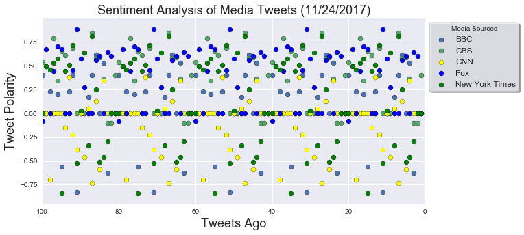
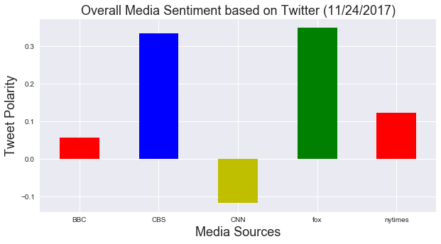
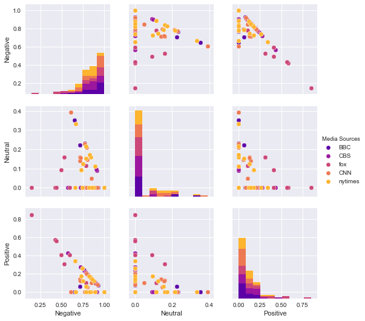

<h1>Distinguishing Sentiments</h1>


<h2> Table of contents</h2>
1. Introduction
2. Import libraries
3. Setup Tweepy API Authentication
4. Use Twitter API to obtain tweets for Media Sources
5. Generated dataframe containing sentiment for Media Sources
6. Save df_sentiment_analysis as a csv titled, 'Sentiment_analyzer_Twitter.csv'
7. Generated dataframes for all media sources
8. Plot of Sentiment Analysis for Media Tweets
9. Generated Overall Media Sentiment based on Twitter table
10. Plot of Overall Media Sentiment Analysis
11. Generated average sentiment scores dataframe
12. Correlation Plot for Polarity Scores
13. Conclusion

<h3><u>Instructions</u></h3>

In this assignment, the goal is to create a Python script to perform a sentiment analysis of the Twitter activity of various news outlets and to present your findings visually.

<h3><u>Import libraries</u></h3>


```python
import tweepy
import numpy as np
import pandas as pd
from datetime import datetime
import matplotlib.pyplot as plt
%matplotlib inline
import numpy as np
import seaborn as sns
from my_keys import *
import warnings
warnings.filterwarnings('ignore')
from vaderSentiment.vaderSentiment import SentimentIntensityAnalyzer
```

<h3><u>Setup Tweepy API Authentication</u></h3>


```python
# Setup Tweepy API Authentication
auth = tweepy.OAuthHandler(consumer_key, consumer_secret)
auth.set_access_token(access_token, access_token_secret)
api = tweepy.API(auth, parser=tweepy.parsers.JSONParser())
```

<h3><u>Use Twitter API to obtain tweets for Media Sources</u></h3>


```python
#Sentiment Intensitiy Analyzer
analyzer = SentimentIntensityAnalyzer()

#Target Account for each Media Source
target_user = ["@BBC","@CBS","@Fox","@CNN","@nytimes"]

# Variables for holding sentiments
sentiments = []

# Loop through 5 pages of tweets (total 100 tweets)
for x in range(5):
    
   
    #loop through each Media Source
    for target in target_user:
        # Get all tweets from home feed
        public_tweets = api.user_timeline(target)
             

        # Loop through all tweets 
        for tweet in public_tweets:
            
            
        # Run vaderSentiment on each tweet
            results = analyzer.polarity_scores(tweet["text"])
            compound = results["compound"]
            pos = results["pos"]
            neu = results["neu"]
            neg = results["neg"]
            
           
        
            # Add sentiments for each tweet into an array
            sentiments.append({"Date": tweet["created_at"],
                               "Screen_Name": tweet['user']['screen_name'],
                               "Compound": compound,
                               "Positive": pos,
                               "Negative": neu,
                               "Neutral": neg})                     
```

<h3><u>Generated dataframe containing sentiment for Media Sources</u></h3>


```python
#Generated dataframe containing sentiment for Media Sources
df_sentiment_analysis= pd.DataFrame(sentiments) 

#display head of df_sentiment_analysis 
df_sentiment_analysis.head()
```


<div>
<style>
    .dataframe thead tr:only-child th {
        text-align: right;
    }

    .dataframe thead th {
        text-align: left;
    }

    .dataframe tbody tr th {
        vertical-align: top;
    }
</style>
<table border="1" class="dataframe">
  <thead>
    <tr style="text-align: right;">
      <th></th>
      <th>Compound</th>
      <th>Date</th>
      <th>Negative</th>
      <th>Neutral</th>
      <th>Positive</th>
      <th>Screen_Name</th>
    </tr>
  </thead>
  <tbody>
    <tr>
      <th>0</th>
      <td>0.4019</td>
      <td>Fri Nov 24 21:17:06 +0000 2017</td>
      <td>0.856</td>
      <td>0.0</td>
      <td>0.144</td>
      <td>BBC</td>
    </tr>
    <tr>
      <th>1</th>
      <td>0.0000</td>
      <td>Fri Nov 24 20:30:06 +0000 2017</td>
      <td>1.000</td>
      <td>0.0</td>
      <td>0.000</td>
      <td>BBC</td>
    </tr>
    <tr>
      <th>2</th>
      <td>0.2263</td>
      <td>Fri Nov 24 20:00:03 +0000 2017</td>
      <td>0.808</td>
      <td>0.0</td>
      <td>0.192</td>
      <td>BBC</td>
    </tr>
    <tr>
      <th>3</th>
      <td>0.0000</td>
      <td>Fri Nov 24 19:35:04 +0000 2017</td>
      <td>1.000</td>
      <td>0.0</td>
      <td>0.000</td>
      <td>BBC</td>
    </tr>
    <tr>
      <th>4</th>
      <td>0.2023</td>
      <td>Fri Nov 24 18:57:03 +0000 2017</td>
      <td>0.917</td>
      <td>0.0</td>
      <td>0.083</td>
      <td>BBC</td>
    </tr>
  </tbody>
</table>
</div>


<h3><u>Save df_sentiment_analysis as a csv titled, 'Sentiment_analyzer_Twitter.csv'</u></h3>


```python
#Save df_sentiment_analysis as a csv titled, 'Sentiment_analyzer_Twitter.csv'.
df_sentiment_analysis.to_csv('Sentiment_analyzer_Twitter.csv',index=False)
```

<h3><u>Generated dataframes for all media sources</u></h3>


```python
#Generated dataframes for all the media sources
df_BBC = df_sentiment_analysis[df_sentiment_analysis['Screen_Name'] == 'BBC']
df_CBS = df_sentiment_analysis[df_sentiment_analysis['Screen_Name'] == 'CBS']
df_fox = df_sentiment_analysis[df_sentiment_analysis['Screen_Name'] == 'fox']
df_CNN = df_sentiment_analysis[df_sentiment_analysis['Screen_Name'] == 'CNN']
df_nytimes = df_sentiment_analysis[df_sentiment_analysis['Screen_Name'] == 'nytimes']
```

<h3><u>Plot of Sentiment Analysis for Media Tweets</u></h3>


```python
#Plot of Sentiment Analysis of Media Tweets
x_values = np.arange(1,df_BBC.shape[0]+1)


plt.figure(figsize=(10,5))
plt.scatter(x_values[::-1],df_BBC['Compound'],edgecolors='black',label='BBC')


plt.scatter(x_values[::-1],df_CBS['Compound'],edgecolors='black',label = 'CBS')
plt.scatter(x_values[::-1],df_CNN['Compound'],edgecolors='black',color='yellow',label='CNN')
plt.scatter(x_values[::-1],df_fox['Compound'],edgecolors='black',color='b',label='Fox')
plt.scatter(x_values[::-1],df_nytimes['Compound'],edgecolors='black',color='green',label='New York Times')

plt.legend(frameon=True,shadow= True,edgecolor='black',fontsize = 'large', title='Media Sources', bbox_to_anchor=(1, 1))
plt.xlim(0,100)
plt.xlabel('Tweets Ago',fontsize='18')
plt.ylabel('Tweet Polarity',fontsize='18')

now = datetime.now()
now = now.strftime("%m/%d/%Y")
plt.title('Sentiment Analysis of Media Tweets ({})'.format(now),fontsize=(18))

plt.xlim(100,0);
```





<h3><u>Generated Overall Media Sentiment based on Twitter table</u></h3>


```python
#Overall Media Sentiment based on Twitter table
df_sentiment_analysis_avg_compound = df_sentiment_analysis.groupby(["Screen_Name"])["Compound"].mean().reset_index()


#rename the columns in df_sentiment_analysis_avg_compound dataframe 
df_sentiment_analysis_avg_compound.rename_axis({'Screen_Name': 'Media Sources',
                                                 'Compound':  'Avg. Compound'},axis=1,inplace=True)

#plot bars in df_sentiment_analysis_avg_compound dataframe
df_sentiment_analysis_avg_compound.style.bar(subset=['Avg. Compound'], align='mid', color=['blue', 'red'])
```


<style  type="text/css" >
    #T_244280a6_d15d_11e7_9bd0_a45e60bc420drow0_col1 {
            width:  10em;
             height:  80%;
            background:  linear-gradient(90deg, transparent 0%, transparent 25.1%, red 25.1%, red 37.6%, transparent 37.6%);
        }    #T_244280a6_d15d_11e7_9bd0_a45e60bc420drow1_col1 {
            width:  10em;
             height:  80%;
            background:  linear-gradient(90deg, transparent 0%, transparent 25.1%, red 25.1%, red 96.7%, transparent 96.7%);
        }    #T_244280a6_d15d_11e7_9bd0_a45e60bc420drow2_col1 {
            width:  10em;
             height:  80%;
            background:  linear-gradient(90deg, transparent 0%, transparent 0.0%, blue 0.0%, blue 25.1%, transparent 25.1%);
        }    #T_244280a6_d15d_11e7_9bd0_a45e60bc420drow3_col1 {
            width:  10em;
             height:  80%;
            background:  linear-gradient(90deg, transparent 0%, transparent 25.1%, red 25.1%, red 100.0%, transparent 100.0%);
        }    #T_244280a6_d15d_11e7_9bd0_a45e60bc420drow4_col1 {
            width:  10em;
             height:  80%;
            background:  linear-gradient(90deg, transparent 0%, transparent 25.1%, red 25.1%, red 51.6%, transparent 51.6%);
        }</style>  
<table id="T_244280a6_d15d_11e7_9bd0_a45e60bc420d" > 
<thead>    <tr> 
        <th class="blank level0" ></th> 
        <th class="col_heading level0 col0" >Media Sources</th> 
        <th class="col_heading level0 col1" >Avg. Compound</th> 
    </tr></thead> 
<tbody>    <tr> 
        <th id="T_244280a6_d15d_11e7_9bd0_a45e60bc420d" class="row_heading level0 row0" >0</th> 
        <td id="T_244280a6_d15d_11e7_9bd0_a45e60bc420drow0_col0" class="data row0 col0" >BBC</td> 
        <td id="T_244280a6_d15d_11e7_9bd0_a45e60bc420drow0_col1" class="data row0 col1" >0.05822</td> 
    </tr>    <tr> 
        <th id="T_244280a6_d15d_11e7_9bd0_a45e60bc420d" class="row_heading level0 row1" >1</th> 
        <td id="T_244280a6_d15d_11e7_9bd0_a45e60bc420drow1_col0" class="data row1 col0" >CBS</td> 
        <td id="T_244280a6_d15d_11e7_9bd0_a45e60bc420drow1_col1" class="data row1 col1" >0.33379</td> 
    </tr>    <tr> 
        <th id="T_244280a6_d15d_11e7_9bd0_a45e60bc420d" class="row_heading level0 row2" >2</th> 
        <td id="T_244280a6_d15d_11e7_9bd0_a45e60bc420drow2_col0" class="data row2 col0" >CNN</td> 
        <td id="T_244280a6_d15d_11e7_9bd0_a45e60bc420drow2_col1" class="data row2 col1" >-0.116925</td> 
    </tr>    <tr> 
        <th id="T_244280a6_d15d_11e7_9bd0_a45e60bc420d" class="row_heading level0 row3" >3</th> 
        <td id="T_244280a6_d15d_11e7_9bd0_a45e60bc420drow3_col0" class="data row3 col0" >fox</td> 
        <td id="T_244280a6_d15d_11e7_9bd0_a45e60bc420drow3_col1" class="data row3 col1" >0.348945</td> 
    </tr>    <tr> 
        <th id="T_244280a6_d15d_11e7_9bd0_a45e60bc420d" class="row_heading level0 row4" >4</th> 
        <td id="T_244280a6_d15d_11e7_9bd0_a45e60bc420drow4_col0" class="data row4 col0" >nytimes</td> 
        <td id="T_244280a6_d15d_11e7_9bd0_a45e60bc420drow4_col1" class="data row4 col1" >0.12362</td> 
    </tr></tbody> 
</table> 


<h3><u>Plot of Overall Media Sentiment Analysis</u></h3>


```python
#Plot of overall Media Sentiment Analysis
plt.figure(figsize=(10,5))
df_sentiment_analysis.groupby(["Screen_Name"])["Compound"].mean().plot(kind='bar',color=['r','b','y','g'])

plt.ylabel('Tweet Polarity',fontsize='18')
plt.xlabel('Media Sources',fontsize='18')
plt.xticks(rotation=0)
now = datetime.now()
now = now.strftime("%m/%d/%Y")
plt.title('Overall Media Sentiment based on Twitter ({})'.format(now),fontsize=(18));

```





<h3><u>Generated average sentiment scores dataframe</u></h3>


```python
df_sentiment_analysis_avg_neg = df_sentiment_analysis.groupby(['Screen_Name'])['Negative'].mean().reset_index()
df_sentiment_analysis_avg_neg.rename_axis({'Screen_Name': 'Media Sources',
                                              'Negative':'Avg. Negative'},axis=1,inplace=True)

df_sentiment_analysis_avg_pos = df_sentiment_analysis.groupby(['Screen_Name'])['Positive'].mean().reset_index()
df_sentiment_analysis_avg_pos.rename_axis({'Screen_Name': 'Media Sources',
                                              'Positive': 'Avg. Positive'},axis=1,inplace=True)

df_sentiment_analysis_avg_neu = df_sentiment_analysis.groupby(['Screen_Name'])['Neutral'].mean().reset_index()
df_sentiment_analysis_avg_neu.rename_axis({'Screen_Name': 'Media Sources',
                                              'Neutral' :'Avg. Neutral'},axis=1,inplace=True)
```


```python
df_avg_sentiment_neg_pos = df_sentiment_analysis_avg_neg.merge(df_sentiment_analysis_avg_pos,how='outer',on='Media Sources')
df_avg_sentiment_neg_pos_neu = df_avg_sentiment_neg_pos.merge(df_sentiment_analysis_avg_neu,how='outer',on='Media Sources')
df_avg_sentiment_neg_pos_neu_compound = df_avg_sentiment_neg_pos_neu.merge(df_sentiment_analysis_avg_compound,how='outer',on='Media Sources')

#Display table
df_avg_sentiment_neg_pos_neu_compound
```


<div>
<style>
    .dataframe thead tr:only-child th {
        text-align: right;
    }

    .dataframe thead th {
        text-align: left;
    }

    .dataframe tbody tr th {
        vertical-align: top;
    }
</style>
<table border="1" class="dataframe">
  <thead>
    <tr style="text-align: right;">
      <th></th>
      <th>Media Sources</th>
      <th>Avg. Negative</th>
      <th>Avg. Positive</th>
      <th>Avg. Neutral</th>
      <th>Avg. Compound</th>
    </tr>
  </thead>
  <tbody>
    <tr>
      <th>0</th>
      <td>BBC</td>
      <td>0.89300</td>
      <td>0.06670</td>
      <td>0.04030</td>
      <td>0.058220</td>
    </tr>
    <tr>
      <th>1</th>
      <td>CBS</td>
      <td>0.87045</td>
      <td>0.12015</td>
      <td>0.00940</td>
      <td>0.333790</td>
    </tr>
    <tr>
      <th>2</th>
      <td>CNN</td>
      <td>0.87555</td>
      <td>0.04225</td>
      <td>0.08215</td>
      <td>-0.116925</td>
    </tr>
    <tr>
      <th>3</th>
      <td>fox</td>
      <td>0.76495</td>
      <td>0.21210</td>
      <td>0.02295</td>
      <td>0.348945</td>
    </tr>
    <tr>
      <th>4</th>
      <td>nytimes</td>
      <td>0.83045</td>
      <td>0.10150</td>
      <td>0.06800</td>
      <td>0.123620</td>
    </tr>
  </tbody>
</table>
</div>


```python
df_sentiment_analysis_neg_neu_pos = df_sentiment_analysis[['Negative', 'Neutral', 'Positive', 'Screen_Name']]
df_sentiment_analysis_neg_neu_pos.rename_axis({'Screen_Name':'Media Sources'},axis= 1,inplace=True)
```

<h3><u>Correlation Plot for Polarity Scores</u></h3>


```python
sns.pairplot(df_sentiment_analysis_neg_neu_pos,hue='Media Sources',palette='plasma');
```





<h3><u>Conclusion</u></h3>
<p>While performing a sentiment analysis for Tweets from various news outlets, I noticed a few different insights. The insights are below:</p>
<h4><u>Insights</u></h4>
<ul>
<li>In the Correlation Plot for Polarity Scores, there is a correlation between positive and negative polarities. As the positivity decreased the negative polarities increased for each media source. </li> 
<p><li>In the Overall Media Sentiment Analysis Plot, CNN appears to have more negative compound tweets.
 </li><br>
<li>BBC has the highest positive polarity scores when compared to all other media sources.</li>
</ul>


```python

```
